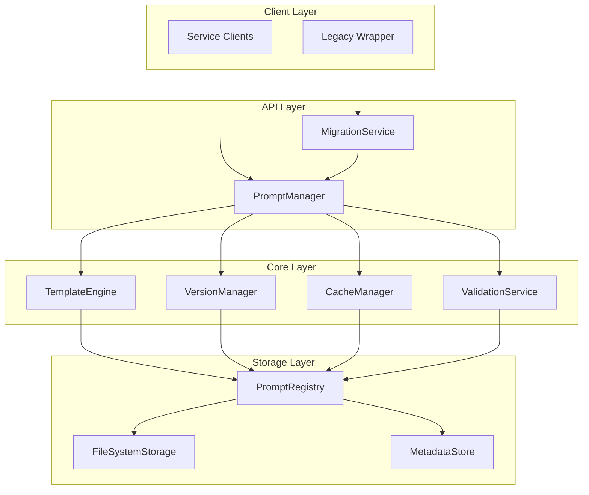

# Design Document: Prompt Management System

## Overview

The Prompt Management System is a centralized infrastructure service that addresses the current scattered prompt landscape by providing a structured, maintainable, and testable approach to prompt management. The system follows established service architecture patterns and provides advanced features including versioning, A/B testing, template-based generation, and backward compatibility during migration.

The design emphasizes treating prompts as first-class software artifacts that require the same rigor as application code, with proper governance, testing, and deployment practices.

## Architecture

The system follows a layered architecture with clear separation of concerns:



### Key Architectural Principles

1. **Service Pattern Consistency**: Follows the same patterns as `eventDeduplicator` and `followUpDetector`
2. **Dependency Injection**: Proper service registration and dependency management
3. **Separation of Concerns**: Clear boundaries between template processing, storage, and caching
4. **Backward Compatibility**: Migration layer ensures smooth transition
5. **Performance First**: Caching and efficient retrieval mechanisms

## Components and Interfaces

### PromptManager (Main Service)

The central orchestrator that provides the primary API for prompt operations.

```typescript
interface IPromptManager {
  // Core retrieval methods
  getPrompt(id: string, version?: string): Promise<Prompt>
  getPromptWithVariables(id: string, variables: Record<string, any>, version?: string): Promise<string>
  
  // Template operations
  renderTemplate(templateId: string, variables: Record<string, any>): Promise<string>
  validateTemplate(templateId: string, sampleVariables: Record<string, any>): Promise<ValidationResult>
  
  // Metadata and discovery
  listPrompts(filter?: PromptFilter): Promise<PromptMetadata[]>
  getPromptMetadata(id: string): Promise<PromptMetadata>
  
  // A/B testing
  getPromptForExperiment(experimentId: string, userId: string): Promise<Prompt>
  
  // Management operations
  createPrompt(prompt: PromptDefinition): Promise<void>
  updatePrompt(id: string, prompt: PromptDefinition): Promise<void>
  deletePrompt(id: string): Promise<void>
}
```

### TemplateEngine

Handles variable substitution and template processing with support for multiple syntax patterns.

```typescript
interface ITemplateEngine {
  render(template: string, variables: Record<string, any>): string
  validate(template: string): ValidationResult
  extractVariables(template: string): string[]
  supportsTemplate(template: string): boolean
}

// Supports multiple template syntaxes:
// - Handlebars-style: {{variable}}
// - Dollar-style: ${variable}
// - Bracket-style: {variable}
```

### VersionManager

Manages prompt versioning, A/B testing, and experiment tracking.

```typescript
interface IVersionManager {
  createVersion(promptId: string, content: PromptDefinition): Promise<string>
  getVersion(promptId: string, version: string): Promise<Prompt>
  listVersions(promptId: string): Promise<VersionInfo[]>
  
  // A/B testing
  createExperiment(config: ExperimentConfig): Promise<string>
  getExperimentVersion(experimentId: string, userId: string): Promise<string>
  recordExperimentUsage(experimentId: string, version: string, userId: string): Promise<void>
}
```

### CacheManager

Provides intelligent caching with configurable strategies and cache invalidation.

```typescript
interface ICacheManager {
  get<T>(key: string): Promise<T | null>
  set<T>(key: string, value: T, ttl?: number): Promise<void>
  invalidate(pattern: string): Promise<void>
  warmCache(promptIds: string[]): Promise<void>
  
  // Cache strategies
  setCacheStrategy(strategy: CacheStrategy): void
  getCacheStats(): CacheStats
}
```

### PromptRegistry

Manages prompt storage, indexing, and retrieval from the file system.

```typescript
interface IPromptRegistry {
  load(id: string): Promise<Prompt>
  save(prompt: PromptDefinition): Promise<void>
  delete(id: string): Promise<void>
  list(filter?: PromptFilter): Promise<PromptMetadata[]>
  
  // Bulk operations
  loadAll(): Promise<Map<string, Prompt>>
  saveAll(prompts: PromptDefinition[]): Promise<void>
  
  // File system integration
  watchForChanges(callback: (changes: FileChange[]) => void): void
  reload(): Promise<void>
}
```

### MigrationService

Provides backward compatibility during the transition from hardcoded prompts.

```typescript
interface IMigrationService {
  // Legacy compatibility
  getLegacyPrompt(legacyId: string): Promise<string>
  mapLegacyToNew(legacyId: string, newId: string): void
  
  // Migration tracking
  recordMigration(serviceId: string, promptId: string): Promise<void>
  getMigrationStatus(): Promise<MigrationStatus>
  
  // Wrapper generation
  generateWrapper(serviceId: string): string
}
```

## Data Models

### Core Prompt Structure

```typescript
interface Prompt {
  id: string
  version: string
  type: PromptType
  content: string
  variables: VariableDefinition[]
  metadata: PromptMetadata
  createdAt: Date
  updatedAt: Date
}

enum PromptType {
  SYSTEM = 'system',
  USER = 'user',
  TEMPLATE = 'template',
  ASSISTANT = 'assistant'
}

interface VariableDefinition {
  name: string
  type: 'string' | 'number' | 'boolean' | 'object'
  required: boolean
  description?: string
  defaultValue?: any
  validation?: ValidationRule[]
}

interface PromptMetadata {
  title: string
  description: string
  category: string
  subcategory?: string
  author: string
  tags: string[]
  usage: UsageStats
  experiments?: ExperimentInfo[]
}
```

### File Storage Format

Prompts are stored in YAML format for human readability and version control integration:

```yaml
# prompts/intent/classification.yaml
id: "intent.classification.main"
version: "1.2.0"
type: "system"
metadata:
  title: "Intent Classification System Prompt"
  description: "Classifies user queries into predefined intent categories"
  category: "intent"
  subcategory: "classification"
  author: "ai-team"
  tags: ["classification", "intent", "system"]
  
content: |
  You are an expert intent classifier for a customer support system.
  
  Given the following user query: "{{userQuery}}"
  
  Classify it into one of these categories:
  {{#each categories}}
  - {{this.name}}: {{this.description}}
  {{/each}}
  
  Respond with only the category name.

variables:
  - name: "userQuery"
    type: "string"
    required: true
    description: "The user's input query to classify"
    
  - name: "categories"
    type: "object"
    required: true
    description: "Array of available intent categories"
    validation:
      - type: "array"
        minItems: 1

experiments:
  - id: "intent-classification-v2"
    versions: ["1.1.0", "1.2.0"]
    traffic: 0.5
    active: true
```

### Directory Structure

```
prompts/
├── intent/
│   ├── classification.yaml
│   ├── interpretation.yaml
│   └── validation.yaml
├── meeting/
│   ├── analysis.yaml
│   ├── summary.yaml
│   └── extraction.yaml
├── assistant/
│   ├── knowledge.yaml
│   ├── research.yaml
│   └── response.yaml
├── extraction/
│   ├── questions.yaml
│   └── answers.yaml
└── shared/
    ├── common-templates.yaml
    └── error-messages.yaml
```

## Correctness Properties

*A property is a characteristic or behavior that should hold true across all valid executions of a system—essentially, a formal statement about what the system should do. Properties serve as the bridge between human-readable specifications and machine-verifiable correctness guarantees.*

Based on the prework analysis, the following properties ensure system correctness:

### Property 1: Prompt Storage and Retrieval Consistency
*For any* valid prompt stored in the system, retrieving it by identifier should return the exact same prompt with all metadata intact
**Validates: Requirements 1.1, 1.2, 1.4**

### Property 2: Template Variable Substitution Completeness  
*For any* template with defined variables, when all required variables are provided, the rendered output should contain no remaining placeholders and preserve the original formatting
**Validates: Requirements 2.1, 2.2, 2.4, 2.5**

### Property 3: Missing Variable Error Handling
*For any* template requiring variables, when required variables are missing, the system should return a descriptive error message identifying the missing variables
**Validates: Requirements 2.3, 6.5**

### Property 4: Version Management Consistency
*For any* prompt, creating or modifying it should assign a unique version identifier, and requesting that specific version should return exactly the same content
**Validates: Requirements 3.1, 3.2, 3.5**

### Property 5: A/B Testing Distribution
*For any* A/B test configuration with specified traffic distribution, the version selection over multiple requests should approximate the configured percentages
**Validates: Requirements 3.3, 3.4**

### Property 6: Prompt Type Classification and Filtering
*For any* prompt stored with a specific type, filtering by that type should include the prompt, and the prompt metadata should always include the correct type information
**Validates: Requirements 5.1, 5.3, 5.4**

### Property 7: Validation Rule Enforcement
*For any* prompt that violates its type-specific validation rules, the system should reject storage and return specific error messages describing the violations
**Validates: Requirements 5.2, 6.1, 6.3**

### Property 8: Cache Consistency and Invalidation
*For any* cached prompt, when the prompt is updated, subsequent retrievals should return the updated version, not the cached version
**Validates: Requirements 9.1, 9.2, 9.4**

### Property 9: Hierarchical Organization Integrity
*For any* prompt stored with category and subcategory metadata, it should be retrievable through hierarchical queries and maintain its organizational structure
**Validates: Requirements 1.3, 1.5**

### Property 10: Migration Service Compatibility
*For any* legacy prompt access pattern, the migration service should redirect to the new system and return functionally equivalent results
**Validates: Requirements 7.1, 7.2**

### Property 11: File Format and Storage Consistency
*For any* prompt stored in the file system, it should be in valid YAML/JSON format and contain all required metadata fields
**Validates: Requirements 10.1, 10.3, 10.5**

### Property 12: Configuration and Environment Adaptability
*For any* valid configuration provided through environment variables or config files, the system should apply those settings and behave according to the configuration
**Validates: Requirements 8.5, 9.3**

<function_calls>
<invoke name="prework">
<parameter name="featureName">prompt-management-system

## Error Handling

The system implements comprehensive error handling with specific error types and descriptive messages:

### Error Categories

1. **Validation Errors**
   - Invalid prompt structure
   - Missing required variables
   - Type mismatch errors
   - Template syntax errors

2. **Not Found Errors**
   - Prompt ID not found
   - Version not found
   - Category not found

3. **Configuration Errors**
   - Invalid cache settings
   - Missing environment variables
   - File system permission errors

4. **Runtime Errors**
   - Template rendering failures
   - Cache operation failures
   - File system operation errors

### Error Response Format

```typescript
interface PromptError {
  code: string
  message: string
  details?: Record<string, any>
  timestamp: Date
  requestId?: string
}

// Example error responses
{
  code: "MISSING_VARIABLES",
  message: "Template requires variables that were not provided",
  details: {
    templateId: "intent.classification.main",
    missingVariables: ["userQuery", "categories"],
    providedVariables: ["context"]
  },
  timestamp: "2024-01-15T10:30:00Z",
  requestId: "req_123456"
}
```

### Error Recovery Strategies

- **Graceful Degradation**: Fall back to default prompts when specific versions fail
- **Cache Fallback**: Use cached versions when file system is unavailable
- **Retry Logic**: Automatic retry for transient failures
- **Circuit Breaker**: Prevent cascade failures in dependent services

## Testing Strategy

The testing strategy employs a dual approach combining unit tests for specific scenarios and property-based tests for comprehensive coverage.

### Property-Based Testing

Property-based tests validate universal correctness properties using **fast-check** library for TypeScript:

- **Minimum 100 iterations** per property test to ensure statistical confidence
- **Random input generation** to test edge cases and unexpected scenarios
- **Shrinking capabilities** to find minimal failing examples
- **Tagged tests** referencing design document properties

Example property test structure:
```typescript
// Feature: prompt-management-system, Property 1: Prompt Storage and Retrieval Consistency
test('stored prompts can be retrieved with identical content', () => {
  fc.assert(fc.property(
    promptGenerator(),
    (prompt) => {
      const stored = promptManager.store(prompt);
      const retrieved = promptManager.getPrompt(prompt.id);
      expect(retrieved).toEqual(stored);
    }
  ), { numRuns: 100 });
});
```

### Unit Testing

Unit tests focus on specific examples, edge cases, and integration points:

- **Template rendering edge cases**: Empty templates, special characters, nested variables
- **Error condition handling**: Invalid inputs, missing files, permission errors  
- **Integration testing**: Service interactions, dependency injection
- **Migration scenarios**: Legacy compatibility, wrapper function behavior

### Testing Configuration

- **Jest** as the primary testing framework
- **fast-check** for property-based testing
- **Test containers** for integration testing with file system
- **Mock services** for isolated unit testing
- **Coverage targets**: 90% line coverage, 100% property coverage

### Test Organization

```
tests/
├── unit/
│   ├── prompt-manager.test.ts
│   ├── template-engine.test.ts
│   ├── version-manager.test.ts
│   └── cache-manager.test.ts
├── properties/
│   ├── storage-consistency.property.ts
│   ├── template-rendering.property.ts
│   ├── version-management.property.ts
│   └── cache-behavior.property.ts
├── integration/
│   ├── file-system.integration.ts
│   ├── service-registration.integration.ts
│   └── migration.integration.ts
└── fixtures/
    ├── sample-prompts.yaml
    ├── invalid-prompts.yaml
    └── test-templates.yaml
```

The comprehensive testing approach ensures both correctness of individual components and system-wide behavioral guarantees, providing confidence in the prompt management system's reliability and maintainability.