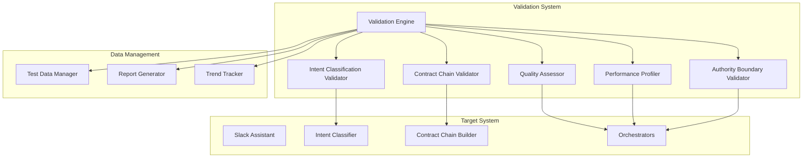

# Design Document

## Overview

The Slack Assistant Validation System is a comprehensive testing and analysis framework designed to validate the correctness, performance, and quality of a Slack-based AI assistant. The system employs a multi-layered validation approach that tests intent classification accuracy, contract chain construction, output quality, performance characteristics, and authority boundary enforcement.

The validation system operates as a standalone testing framework that can run automated validation suites against the existing Slack assistant implementation. It provides detailed reporting, trend analysis, and actionable recommendations for system improvements.

## Architecture

The validation system follows a modular architecture with five core validation engines and supporting infrastructure:



## Components and Interfaces

### Validation Engine

The central orchestrator that coordinates all validation activities and manages the validation workflow.

**Interface:**
```typescript
interface ValidationEngine {
  runValidation(config: ValidationConfig): Promise<ValidationResult>
  scheduleValidation(schedule: ValidationSchedule): void
  getValidationHistory(): ValidationHistory[]
}

interface ValidationConfig {
  testSuites: TestSuite[]
  thresholds: ValidationThresholds
  reportFormat: ReportFormat[]
  parallelExecution: boolean
}
```

### Intent Classification Validator

Validates the accuracy of intent classification using ground truth datasets and multiple evaluation metrics.

**Interface:**
```typescript
interface IntentClassificationValidator {
  validateIntentAccuracy(testMessages: TestMessage[]): IntentValidationResult
  measureClassificationMetrics(predictions: IntentPrediction[], groundTruth: IntentLabel[]): ClassificationMetrics
  analyzeConfusionMatrix(results: IntentValidationResult): ConfusionAnalysis
}

interface ClassificationMetrics {
  accuracy: number
  precision: Record<IntentType, number>
  recall: Record<IntentType, number>
  f1Score: Record<IntentType, number>
  macroF1: number
  microF1: number
}
```

**Validation Approach:**
- Uses stratified test datasets covering all intent types
- Implements k-fold cross-validation for robust accuracy measurement
- Analyzes confusion matrices to identify systematic misclassification patterns
- Tests edge cases like ambiguous messages and multi-intent scenarios

### Contract Chain Validator

Validates the correctness and completeness of contract chain construction for complex multi-step requests.

**Interface:**
```typescript
interface ContractChainValidator {
  validateChainConstruction(request: ValidationRequest): ChainValidationResult
  verifyContractSequencing(chain: AnswerContract[]): SequencingResult
  validateContextLayerMapping(chain: AnswerContract[]): ContextValidationResult
}

interface ChainValidationResult {
  isComplete: boolean
  missingContracts: ContractType[]
  incorrectSequencing: SequencingError[]
  contextLayerIssues: ContextError[]
  ssotModeConsistency: boolean
}
```

**Validation Approach:**
- Tests contract chain building against known complex request patterns
- Validates that all necessary contracts are included for multi-step requests
- Verifies proper SSOT mode assignment for each contract
- Ensures context layer requirements are met for each contract

### Quality Assessor

Evaluates the quality of generated outputs using both automated metrics and structured quality criteria.

**Interface:**
```typescript
interface QualityAssessor {
  assessOutputQuality(output: GeneratedOutput, contractType: ContractType): QualityScore
  measureTextQuality(text: string, reference?: string): TextQualityMetrics
  evaluateStructuralQuality(output: GeneratedOutput): StructuralQuality
}

interface TextQualityMetrics {
  bleuScore?: number  // For outputs with reference text
  rougeScores?: RougeScores  // For summarization tasks
  coherenceScore: number
  relevanceScore: number
  completenessScore: number
}

interface QualityScore {
  overall: number
  dimensions: {
    accuracy: number
    completeness: number
    clarity: number
    relevance: number
    structure: number
  }
}
```

**Quality Evaluation Approach:**
- **DRAFT_EMAIL contracts**: Evaluates email structure (subject, greeting, body, closing), tone appropriateness, content relevance, and actionability
- **MEETING_SUMMARY contracts**: Uses ROUGE metrics to compare against reference summaries, measures completeness and accuracy
- **PATTERN_ANALYSIS contracts**: Assesses analytical depth, insight quality, and evidence support
- **General outputs**: Measures coherence, relevance, and completeness using transformer-based quality models

### Performance Profiler

Measures and analyzes system performance characteristics to identify bottlenecks and optimization opportunities.

**Interface:**
```typescript
interface PerformanceProfiler {
  profileEndToEndPerformance(requests: ValidationRequest[]): PerformanceReport
  measurePipelineStages(request: ValidationRequest): StageTimings
  analyzeBottlenecks(timings: StageTimings[]): BottleneckAnalysis
}

interface StageTimings {
  intentClassification: number
  contextLayerResolution: number
  contractChainBuilding: number
  dataFetching: number
  orchestration: number
  responseGeneration: number
  total: number
}

interface PerformanceReport {
  averageResponseTime: number
  p95ResponseTime: number
  p99ResponseTime: number
  bottlenecks: BottleneckAnalysis
  regressionDetection: RegressionAnalysis
}
```

**Performance Measurement Approach:**
- Uses Node.js Performance Hooks API for high-resolution timing measurements
- Measures each pipeline stage independently to identify specific bottlenecks
- Tracks parallel processing effectiveness in data fetching operations
- Validates progress message delivery for long-running requests (>15 seconds)
- Implements performance regression detection across validation runs

### Authority Boundary Validator

Ensures the assistant maintains proper authority boundaries and never invents facts while remaining helpful.

**Interface:**
```typescript
interface AuthorityBoundaryValidator {
  validateFactualClaims(output: GeneratedOutput, sources: DataSource[]): AuthorityValidationResult
  detectFactInvention(output: GeneratedOutput): FactInventionAnalysis
  validateSourceAttribution(output: GeneratedOutput): AttributionValidation
}

interface AuthorityValidationResult {
  authorityViolations: AuthorityViolation[]
  sourceVerification: SourceVerificationResult[]
  boundaryCompliance: boolean
  trustworthinessScore: number
}

interface AuthorityViolation {
  type: 'FACT_INVENTION' | 'ASSUMPTION_UPGRADE' | 'MISSING_ATTRIBUTION' | 'BOUNDARY_CROSSING'
  severity: 'LOW' | 'MEDIUM' | 'HIGH' | 'CRITICAL'
  description: string
  location: TextLocation
}
```

**Authority Validation Approach:**
- **Fact verification**: Cross-references all factual claims against meeting transcripts and product data
- **Attribution checking**: Ensures external research is properly cited with time bounds
- **Boundary detection**: Identifies when responses cross from authoritative to descriptive modes
- **Limitation acknowledgment**: Verifies the system explicitly states when factual data is missing
- **Single-meeting boundary enforcement**: Validates meeting-specific questions maintain proper scope

## Data Models

### Test Data Models

```typescript
interface TestMessage {
  id: string
  content: string
  expectedIntent: IntentType
  expectedEntities: Entity[]
  expectedContracts: ContractType[]
  complexity: 'SIMPLE' | 'MODERATE' | 'COMPLEX'
  category: TestCategory
}

interface ValidationRequest {
  message: TestMessage
  context: ValidationContext
  expectedOutput?: ExpectedOutput
  performanceThresholds: PerformanceThresholds
}

interface ValidationContext {
  availableData: DataAvailability
  userContext: UserContext
  channelContext: ChannelContext
}
```

### Result Models

```typescript
interface ValidationResult {
  timestamp: Date
  overallScore: number
  componentResults: {
    intentClassification: IntentValidationResult
    contractChaining: ChainValidationResult
    outputQuality: QualityValidationResult
    performance: PerformanceValidationResult
    authorityBoundaries: AuthorityValidationResult
  }
  recommendations: Recommendation[]
  regressionFlags: RegressionFlag[]
}

interface Recommendation {
  component: ValidationComponent
  priority: 'LOW' | 'MEDIUM' | 'HIGH' | 'CRITICAL'
  description: string
  suggestedActions: string[]
  estimatedImpact: ImpactEstimate
}
```

Now I need to use the prework tool to analyze the acceptance criteria before writing the Correctness Properties section:
## Correctness Properties

*A property is a characteristic or behavior that should hold true across all valid executions of a system—essentially, a formal statement about what the system should do. Properties serve as the bridge between human-readable specifications and machine-verifiable correctness guarantees.*

Based on the prework analysis and property reflection, the following properties define the correctness requirements for the validation system:

### Intent Classification Properties

**Property 1: Intent classification accuracy across keyword patterns**
*For any* validation message containing specific keyword patterns (meeting, product, multiple intents), the Intent_Classifier should return the corresponding expected intent type with measurable accuracy
**Validates: Requirements 1.1, 1.2, 1.3**

**Property 2: LLM fallback reliability**
*For any* validation message that fails keyword pattern matching, the Intent_Classifier should use LLM fallback and return a valid intent from the defined intent set
**Validates: Requirements 1.4**

**Property 3: Entity extraction accuracy**
*For any* validation message containing known entities (companies, contacts), the Intent_Classifier should correctly identify and extract those entities with measurable precision and recall
**Validates: Requirements 1.5**

**Property 4: Classification analysis completeness**
*For any* set of intent classification results, the Validation_Engine should compute accuracy metrics and identify misclassified intents with detailed error analysis
**Validates: Requirements 1.6, 1.7**

### Contract Chain Construction Properties

**Property 5: Single-intent contract chain correctness**
*For any* single-intent validation request, the Contract_Chain should contain exactly one appropriate contract with correct SSOT_Mode and required context layers
**Validates: Requirements 2.1, 2.4, 2.5**

**Property 6: Multi-step contract chain completeness**
*For any* multi-step validation request, the Contract_Chain should contain all necessary contracts in correct sequence with proper SSOT_Mode settings
**Validates: Requirements 2.2, 2.4**

**Property 7: Contract chain validation accuracy**
*For any* contract chain validation run, the Validation_Engine should correctly identify missing contracts, incorrect sequencing, and context layer issues across diverse request types
**Validates: Requirements 2.3, 2.6, 2.7**

### Output Quality Assessment Properties

**Property 8: Contract-specific quality evaluation**
*For any* generated output from DRAFT_EMAIL, MEETING_SUMMARY, or PATTERN_ANALYSIS contracts, the Quality_Assessor should evaluate all relevant quality dimensions (structure, accuracy, completeness, relevance) using standardized metrics
**Validates: Requirements 3.1, 3.2, 3.3, 3.4**

**Property 9: Quality issue detection and benchmarking**
*For any* generated output, the Quality_Assessor should identify quality issues, categorize them appropriately, and compare against established benchmarks
**Validates: Requirements 3.5, 3.6**

### Performance Profiling Properties

**Property 10: Comprehensive timing measurement**
*For any* validation request, the Performance_Profiler should measure end-to-end response times and identify pipeline stages that exceed timing thresholds across all request types
**Validates: Requirements 4.1, 4.2**

**Property 11: Data source and parallel processing analysis**
*For any* validation request involving data fetching, the Performance_Profiler should measure data source performance and analyze parallel processing effectiveness
**Validates: Requirements 4.3, 4.5**

**Property 12: Progress message validation for long requests**
*For any* validation request taking longer than 15 seconds, the Performance_Profiler should validate that progress messages are properly delivered
**Validates: Requirements 4.4**

**Property 13: Performance regression detection**
*For any* series of validation runs over time, the Performance_Profiler should identify performance regression patterns and generate optimization recommendations
**Validates: Requirements 4.6, 4.7**

### Authority Boundary Enforcement Properties

**Property 14: Authoritative fact verification**
*For any* response marked as authoritative, the Validation_Engine should verify that all factual claims are sourced from meeting transcripts or product data with no silent fact invention
**Validates: Requirements 5.1, 5.4**

**Property 15: External research citation validation**
*For any* response containing external research, the Validation_Engine should ensure proper citation with time bounds and clear separation from authoritative facts
**Validates: Requirements 5.2, 5.6**

**Property 16: Data limitation acknowledgment**
*For any* response where factual data is missing, the Validation_Engine should verify the response explicitly acknowledges this limitation while maintaining helpfulness
**Validates: Requirements 5.3**

**Property 17: Meeting boundary enforcement**
*For any* meeting-specific question, the Validation_Engine should verify single-meeting boundaries are maintained and trustworthiness principles are never violated
**Validates: Requirements 5.5, 5.7**

### Test Data Management and Reporting Properties

**Property 18: Comprehensive test dataset support**
*For any* validation run, the Validation_Engine should support diverse test datasets covering all intent types with proper ground truth labels and synthetic edge case generation
**Validates: Requirements 6.1, 6.2, 6.3**

**Property 19: Historical tracking and reproducibility**
*For any* validation execution, the Validation_Engine should track results over time for regression detection while maintaining test data versioning and reproducibility
**Validates: Requirements 6.4, 6.6**

**Property 20: Comprehensive reporting and integration**
*For any* completed validation run, the Validation_Engine should generate detailed reports with actionable recommendations, support automated scheduling, and provide trend analysis across multiple runs
**Validates: Requirements 6.7, 7.1, 7.2, 7.3, 7.5**

**Property 21: Customization and export capabilities**
*For any* validation configuration, the Validation_Engine should support custom metrics, thresholds, integration with monitoring systems, and export results in multiple formats
**Validates: Requirements 7.4, 7.6, 7.7**

## Error Handling

The validation system implements comprehensive error handling across all components:

### Validation Engine Error Handling
- **Configuration errors**: Invalid test configurations are rejected with detailed error messages
- **Component failures**: Individual validator failures don't stop the entire validation run
- **Data access errors**: Missing or corrupted test data is handled gracefully with fallback mechanisms
- **Timeout handling**: Long-running validations have configurable timeouts with partial result reporting

### Component-Specific Error Handling
- **Intent Classification Validator**: Handles malformed messages, API failures, and edge cases
- **Contract Chain Validator**: Manages invalid contract configurations and missing context layers
- **Quality Assessor**: Handles missing reference texts and unsupported output formats
- **Performance Profiler**: Manages timing measurement failures and resource constraints
- **Authority Boundary Validator**: Handles missing source data and ambiguous fact claims

### Recovery Mechanisms
- **Graceful degradation**: System continues with reduced functionality when components fail
- **Retry logic**: Transient failures are automatically retried with exponential backoff
- **Fallback validation**: Alternative validation methods when primary approaches fail
- **Error aggregation**: All errors are collected and reported in the final validation results

## Testing Strategy

The validation system employs a dual testing approach combining unit tests for specific scenarios and property-based tests for comprehensive coverage:

### Unit Testing Approach
- **Component isolation**: Each validator component is tested independently
- **Edge case coverage**: Specific tests for boundary conditions and error scenarios
- **Integration testing**: Tests for component interactions and data flow
- **Mock data testing**: Controlled testing with known inputs and expected outputs

### Property-Based Testing Approach
- **Universal property validation**: Each correctness property is implemented as a property-based test
- **Randomized input generation**: Comprehensive testing across input space using generators
- **Minimum 100 iterations**: Each property test runs at least 100 iterations for statistical confidence
- **Shrinking on failure**: Failed test cases are automatically minimized to identify root causes

### Testing Framework Configuration
- **Framework**: Uses fast-check for TypeScript property-based testing
- **Test tagging**: Each property test is tagged with format: **Feature: slack-assistant-validation, Property {number}: {property_text}**
- **Parallel execution**: Tests run in parallel where possible to reduce execution time
- **Continuous integration**: All tests run on every code change with failure notifications

### Test Data Strategy
- **Synthetic data generation**: Automated generation of test messages covering all intent types
- **Real data sampling**: Anonymized samples from actual Slack interactions for realistic testing
- **Edge case datasets**: Curated collections of challenging validation scenarios
- **Ground truth maintenance**: Version-controlled reference datasets with expert annotations

### Performance Testing
- **Load testing**: Validation system performance under high test volume
- **Memory profiling**: Ensuring validation doesn't consume excessive resources
- **Concurrent validation**: Testing multiple validation runs simultaneously
- **Regression testing**: Performance benchmarks to detect validation system slowdowns

The testing strategy ensures both the correctness of individual validation components and the overall system behavior across all possible inputs and scenarios.