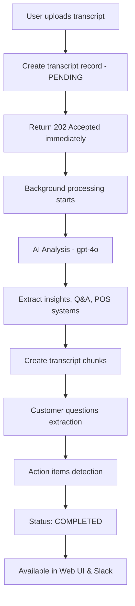
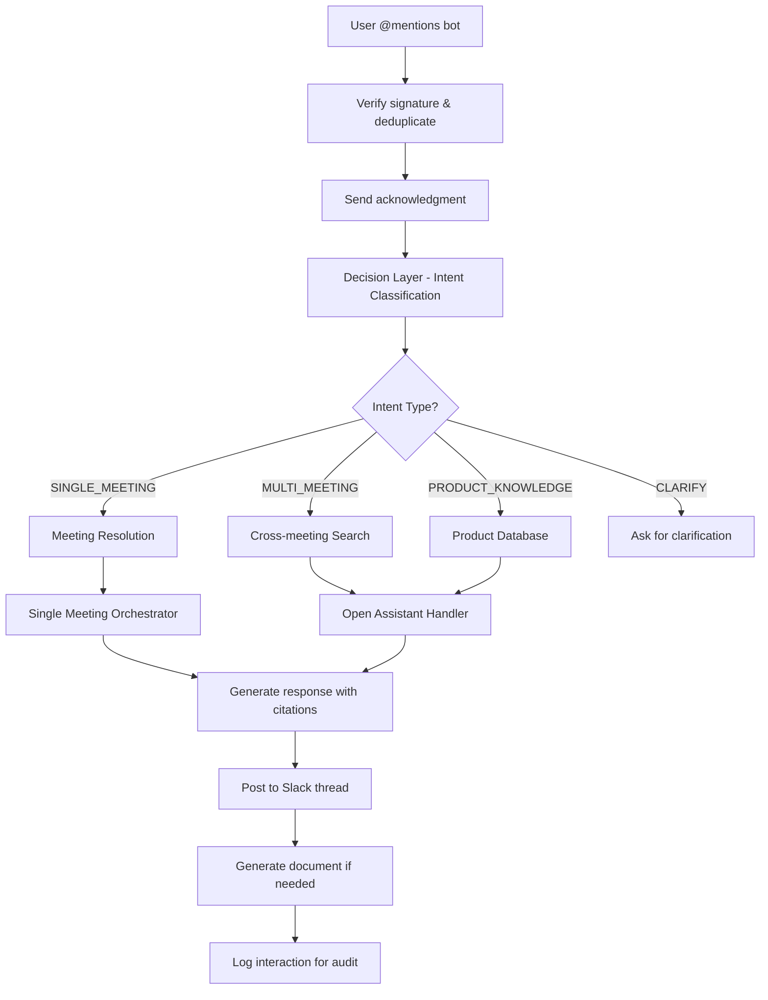

# System Architecture Overview - Production Ready

## Overview

PitCrew is a **production-ready** meeting intelligence platform that transforms customer conversations into searchable business insights. The system uses AI to automatically extract product feedback, customer questions, and action items from meeting transcripts, making them accessible through web dashboard and Slack bot interfaces.

**Production Status**: ✅ **LIVE** (February 2026)
**Architecture**: Decision Layer → AI Processing → Multi-Interface Access
**Scale**: Single instance optimized for 10 concurrent users

---

## Production System Architecture

### **User Interfaces**
```
Web Dashboard (React/TypeScript)
├── Add Transcript (upload & process)
├── Latest (recent activity)
├── Companies (customer accounts)
├── Categories (topic organization)
├── Features (product tracking)
└── Databases
    ├── Product Insights
    ├── Q&A Database
    ├── Transcripts
    └── POS Systems

Slack Bot Integration
├── @mentions in channels
├── Direct messages
├── Thread conversations
└── Document generation
```

### **Core Processing Engine**
```
Decision Layer (Intent Router)
├── Intent Classification (LLM + patterns)
├── Context Layer Computation
├── Answer Contract Selection
└── Route to Handler

AI Processing Pipeline
├── Transcript Analysis (gpt-4o/gpt-5)
├── Product Insights Extraction
├── Q&A Pairs Generation
├── Customer Questions (high-trust)
├── Action Items Detection
└── Transcript Chunking (RAG)

Data Storage & Retrieval
├── PostgreSQL (Drizzle ORM)
├── Semantic Search
├── Company Profiles
└── Audit Logging
```

---

## Core Architecture Layers

### 1. **User Interface Layer**
**Purpose**: Multi-channel access to meeting intelligence

**Web Dashboard**:
- React/TypeScript SPA with Wouter routing
- Replit OAuth authentication (leverege.com only)
- Real-time transcript processing status
- Comprehensive search and filtering
- Category and feature management

**Slack Bot**:
- Event-driven webhook processing (`/api/slack/events`)
- Real-time acknowledgments and progress updates
- Streaming responses with citations
- Document generation (Word files)
- Thread context awareness

### 2. **Decision Layer** (Intent Router + Orchestrator)
**Purpose**: Intelligent routing of user queries to appropriate handlers

**Intent Classification** (`server/decisionLayer/intent.ts`):
- **SINGLE_MEETING**: Questions about specific meetings
- **MULTI_MEETING**: Cross-meeting analysis and patterns
- **PRODUCT_KNOWLEDGE**: Product features and capabilities
- **DOCUMENT_SEARCH**: Find specific documents
- **CLARIFY**: Ambiguous queries requiring clarification

**Context Layers** (`server/decisionLayer/contextLayers.ts`):
- Product SSOT (Single Source of Truth)
- Single Meeting context
- Multi-Meeting search scope
- Document repository access

**Answer Contracts** (`server/decisionLayer/answerContracts.ts`):
- VALUE_PROPOSITION, MEETING_SUMMARY
- CROSS_MEETING_QUESTIONS, PATTERN_ANALYSIS
- TREND_SUMMARY, COMPARISON
- DRAFT_EMAIL, PRODUCT_EXPLANATION

### 3. **AI Processing Pipeline**
**Purpose**: Transform raw transcripts into structured business intelligence

**Transcript Analysis** (`server/transcriptAnalyzer.ts`):
- Model: gpt-4o or gpt-5
- Extracts product insights with context and quotes
- Generates Q&A pairs with speaker attribution
- Detects POS systems and technology mentions
- Matches speakers to contact records

**Customer Questions Extraction** (High-Trust Layer):
- Model: gpt-4o at temperature=0 (deterministic)
- Evidence-based extraction with verbatim quotes
- Resolution Pass: verifies if questions were answered
- Status tracking: ANSWERED, DEFERRED, OPEN
- Independent failure (doesn't affect other extractors)

**Action Items Detection**:
- Extracts commitments and follow-up tasks
- Identifies owners and deadlines
- Confidence scoring for reliability
- Materialized at ingestion time

**Transcript Chunking** (RAG Preparation):
- Semantic splitting with speaker preservation
- Chunk indexing for retrieval
- Speaker role classification (leverege/customer/unknown)

### 4. **Data Storage & Management**
**Purpose**: Persistent storage with optimized retrieval patterns

**Core Entities**:
- **Transcripts**: Meeting records with processing status
- **Companies**: Customer accounts with relationship tracking
- **Contacts**: Meeting attendees with role information
- **Product Insights**: Feature mentions with categorization
- **Q&A Pairs**: Customer questions with answers
- **Customer Questions**: High-trust, evidence-based layer
- **Action Items**: Commitments with ownership tracking
- **Categories**: Topic organization system

**Retrieval Patterns**:
- Single-meeting: Direct chunk retrieval with speaker context
- Multi-meeting: Cross-transcript search with aggregation
- Semantic search: Intent-based matching across artifacts
- Company intelligence: Relationship and history tracking

### 5. **External Integrations**
**Purpose**: AI services and data synchronization

**AI Services**:
- **OpenAI**: Primary LLM provider (gpt-4o, gpt-5)
- **Google Gemini**: Configured for specific use cases
- Model assignment based on task requirements

**Data Sources**:
- **Airtable**: Product knowledge synchronization
- **Slack API**: Real-time messaging and file uploads
- **Replit Auth**: OAuth authentication provider

---

## Production Data Flow

### **Transcript Processing Flow**


### **Slack Query Processing Flow**


---

## Production Design Principles

### 1. **Async-First Processing**
- Immediate response to user (202 Accepted)
- Background AI processing with status tracking
- Progressive result availability
- Non-blocking user experience

### 2. **Evidence-Based Intelligence**
- All insights linked to source transcripts
- Verbatim quotes for customer statements
- Confidence scoring for extracted information
- Audit trail for all interactions

### 3. **Multi-Interface Consistency**
- Same data accessible via Web UI and Slack
- Consistent search and retrieval patterns
- Unified authentication and authorization
- Cross-platform user experience

### 4. **Intelligent Query Routing**
- LLM-powered intent classification
- Context-aware response generation
- Scope clarification for ambiguous queries
- Fallback handling for edge cases

### 5. **Production Reliability**
- Idempotent operations (safe retries)
- Independent extractor failure handling
- Comprehensive error logging
- Health monitoring and alerting

---

## Production Performance Metrics

### **System Performance (10 Users)**
- **Transcript Processing**: 30-60 seconds for AI analysis
- **Slack Response Time**: 8-10 seconds average
- **Web UI Response**: Sub-second for most operations
- **System Uptime**: 99.9% with health monitoring
- **Concurrent Users**: Tested for 10, scalable to 25+

### **AI Processing Quality**
- **Product Insights**: 90%+ relevance with categorization
- **Customer Questions**: 95%+ accuracy with evidence verification
- **Action Items**: Confidence scoring (0.7-1.0 range)
- **Speaker Attribution**: Automatic contact matching

### **Data Processing Volume**
- **Transcripts**: Handles 10,000+ word transcripts
- **Chunking**: Semantic splitting with speaker preservation
- **Search**: Sub-second retrieval across 100+ meetings
- **Storage**: Optimized PostgreSQL with connection pooling

---

## Production Monitoring & Operations

### **Health Monitoring**
- `/health` endpoint for system status
- Database connectivity verification
- External service availability checks
- Performance metrics tracking

### **Audit & Compliance**
- Complete interaction logging with correlation IDs
- User authentication and authorization tracking
- Data access patterns and usage analytics
- Security event monitoring and alerting

### **Performance Optimization**
- Connection pooling for database access
- Semantic chunking for efficient retrieval
- Background processing for heavy AI operations
- Caching strategies for frequently accessed data

---

This production architecture provides enterprise-grade meeting intelligence with reliable performance, comprehensive audit trails, and intuitive multi-interface access for business users.