# System Conceptual Map - Production Ready

## Overview

The PitCrew Customer Transcript Analyzer is a **production-ready** AI-powered system deployed for up to 10 internal users at Leverege. The system processes business development call transcripts to extract actionable intelligence using a **Control Plane Architecture** with **LLM-First Intent Classification** and **Performance-Optimized Data Access**.

**Production Status**: ✅ **LIVE** (February 2026)
**Deployment Scale**: Single instance optimized for 10 concurrent users
**Performance**: 8-10 second average response time with 95%+ cache hit rate

---

## Production Architecture Overview

### Deployment Configuration
- **Single Instance**: Optimized for 10 concurrent users
- **Database**: PostgreSQL with connection pooling
- **Authentication**: Replit OAuth with leverege.com domain restriction
- **Security**: CSRF protection, rate limiting, secure cookies
- **Monitoring**: Health checks, structured logging, correlation tracking
- **Backup**: Automated daily database backups

### Performance Characteristics
- **Response Time**: 8-10 seconds average (47% improvement)
- **Product Knowledge**: 2-5 seconds (6-19x improvement)
- **Cache Hit Rate**: 95%+ for frequently accessed data
- **Concurrent Users**: Tested for 10, scalable to 25+
- **Uptime Target**: 99.9% with automated health monitoring

---

## Core Architecture Layers

### 1. **Control Plane** (Intent Classification & Routing)
**Purpose**: Semantic understanding and intelligent routing of user requests

**Key Components**:
- **Intent Classifier** (`server/controlPlane/intent.ts`)
  - Uses GPT-4o-mini for semantic understanding
  - Classifies into 8 intent types: SINGLE_MEETING, MULTI_MEETING, PRODUCT_KNOWLEDGE, EXTERNAL_RESEARCH, DOCUMENT_SEARCH, GENERAL_HELP, REFUSE, CLARIFY
  - **Performance Optimization**: High-confidence pattern matches (≥0.9) skip LLM validation
  
- **Contract Selector** (`server/controlPlane/answerContracts.ts`)
  - Maps intents to execution contracts
  - Supports contract chaining for complex requests
  - 25+ contract types with specific constraints and authority levels

**Flow**:
```
User Message → Intent Classification → Contract Selection → Execution Routing
```

### 2. **Execution Plane** (Request Processing)
**Purpose**: Execute classified requests with appropriate data sources and processing

**Key Handlers**:
- **Single Meeting Orchestrator** (`server/mcp/singleMeetingOrchestrator.ts`)
  - Handles specific meeting queries
  - Direct artifact access for performance
  
- **Open Assistant Handler** (`server/openAssistant/openAssistantHandler.ts`)
  - Multi-meeting analysis
  - Product knowledge queries with caching
  - External research with web integration
  
- **Meeting Resolver** (`server/mcp/meetingResolver.ts`)
  - Intelligent meeting lookup
  - Company and contact entity resolution
  - Fallback to most recent meeting when ambiguous

### 3. **Data Access Layer** (Optimized Data Retrieval)
**Purpose**: High-performance access to meeting data and product knowledge

**Key Components**:
- **Meeting Data** (`server/storage.ts`)
  - PostgreSQL with Drizzle ORM
  - Optimized queries for meeting search and retrieval
  
- **Product Knowledge Cache** (`server/airtable/productData.ts`) ⚡ **NEW**
  - **Pre-computed snapshots** in `pitcrewProductSnapshot` table
  - **6-19x performance improvement** (30-95s → 2-5s)
  - Automatic cache rebuilding on Airtable sync
  - Fast path (1 query) vs slow path (5 queries) architecture

**Performance Architecture**:
```
Request → Check Snapshot → Return Pre-computed Data (Fast Path)
       → Compute On-Demand → Cache Result (Slow Path Fallback)
```

### 4. **Production Operations** (Monitoring & Reliability)
**Purpose**: Ensure system reliability and performance for production users

**Key Components**:
- **Health Monitoring** (`/health` endpoint)
  - System status checks
  - Database connectivity verification
  - External service availability
  
- **Performance Tracking** (`server/utils/slackLogger.ts`)
  - Request correlation IDs
  - Stage timing analysis
  - Response time monitoring
  - Cache performance metrics
  
- **Security Controls** (`server/middleware/security.ts`)
  - Rate limiting on authentication endpoints
  - CSRF protection with SameSite cookies
  - Origin validation for state-changing requests
  - Security headers and content policies

**Production Features**:
```
Health Check → Performance Monitoring → Security Controls → Audit Logging
```

### 5. **External Integrations**
**Purpose**: Connect with external data sources and services

**Integrations**:
- **Airtable Sync** (`server/airtable/sync.ts`)
  - Product knowledge synchronization
  - Automatic webhook-triggered updates
  - Schema discovery and column auto-addition
  
- **OpenAI API** (GPT-5, GPT-4o, GPT-4o-mini)
  - Intent classification
  - Content generation
  - Semantic analysis
  
- **Google Gemini** (`server/openAssistant/externalResearch.ts`)
  - Web research capabilities
  - Website content analysis
  - External company research

---

## Production Data Flow Architecture

### 1. **User Request Processing Flow**

```mermaid
graph TD
    A[User Message] --> B[Health Check ✅]
    B --> C[Authentication Check]
    C --> D[Rate Limiting Check]
    D --> E[Control Plane]
    E --> F{Intent Classification}
    F -->|SINGLE_MEETING| G[Meeting Resolver]
    F -->|MULTI_MEETING| H[Open Assistant]
    F -->|PRODUCT_KNOWLEDGE| I[Product Cache ⚡]
    F -->|EXTERNAL_RESEARCH| J[Web Research]
    
    G --> K[Single Meeting Orchestrator]
    H --> L[Multi-Meeting Analysis]
    I --> M[Cached Product Data]
    J --> N[Gemini Research]
    
    K --> O[Response + Logging]
    L --> O
    M --> O
    N --> O
```


### 2. **Product Knowledge Caching Flow** ⚡ **NEW**


### 3. **Contract Chain Execution**

```mermaid
graph TD
    A[User Request] --> B[Intent: EXTERNAL_RESEARCH]
    B --> C[Contract Chain Builder]
    C --> D[Chain: EXTERNAL_RESEARCH → PRODUCT_KNOWLEDGE → SALES_DECK_PREP]
    
    D --> E[Execute: Web Research]
    E --> F[Execute: Product Data]
    F --> G[Execute: Deck Generation]
    G --> H[Combined Response]
```


### 4. **Production Monitoring Flow** ⚡ **NEW**


---

## Production Performance Optimizations

### ✅ **Completed Optimizations**

#### 1. **Product Knowledge Caching System** (January 29, 2026)
- **Problem**: 30-95 second response times for product queries
- **Solution**: Pre-computed snapshots in database
- **Result**: 6-19x performance improvement (2-5 second responses)
- **Architecture**: Singleton snapshot table with automatic rebuilding

#### 2. **Structured Logging Infrastructure** (January 28, 2026)
- **Correlation IDs**: Track requests across pipeline
- **Stage Timing**: Measure individual component performance
- **Log Level Filtering**: Control verbosity via environment variables
- **Daily Rotation**: Structured JSON logs with automatic cleanup

#### 3. **Production Readiness Optimizations** (February 2026)
- **Problem**: System not ready for user deployment
- **Solution**: Health monitoring, security hardening, performance tracking
- **Result**: Production-ready for 10 users with 99.9% uptime target
- **Features**: Health checks, rate limiting, CSRF protection, audit logging

### 🎯 **Future Optimizations (When Scaling Beyond 10 Users)**

#### 4. **Multi-Instance Deployment** (Future)
- **Trigger**: When approaching 25+ concurrent users
- **Solution**: Load balancer with multiple app instances
- **Requirements**: Redis for session storage, job queue for background processing

#### 5. **Database Optimization** (Future)
- **Trigger**: When query response times exceed 5 seconds
- **Solution**: Read replicas, query optimization, connection pooling
- **Requirements**: Database performance monitoring and query analysis

---

## Production Design Principles

### 1. **Reliability-First Architecture**
- Health monitoring and automated recovery
- Graceful degradation for external service failures
- Comprehensive error handling and user feedback
- Audit trail for all user interactions

### 2. **Security-by-Design**
- Domain-restricted authentication (leverege.com only)
- CSRF protection with SameSite cookies
- Rate limiting to prevent abuse
- Secure headers and content policies

### 3. **Performance-Optimized for Scale**
- Pre-computed caches for frequently accessed data
- Intelligent fallback mechanisms for cache misses
- Single-instance optimization for 10 users
- Scalability path defined for future growth

### 4. **Operational Excellence**
- Structured logging with correlation IDs
- Performance monitoring and alerting
- Automated backup and recovery procedures
- Clear troubleshooting and support procedures

---

## Production Data Models

### Core Business Entities
- **Transcripts**: Meeting recordings with processing status and metadata
- **Companies**: Customer organizations with stage tracking and contact management
- **Product Knowledge**: Features, value propositions, customer segments (cached)
- **Meeting Artifacts**: Action items, questions, commitments (materialized at ingestion)
- **User Interactions**: Slack conversations with correlation tracking and audit trail

### Production Performance Tables
- **`pitcrewProductSnapshot`**: Pre-computed product knowledge cache (singleton)
- **`interaction_logs`**: Request tracking with correlation IDs and performance metrics
- **`airtable_sync_logs`**: Data synchronization history and cache rebuild tracking
- **`sessions`**: PostgreSQL-backed session storage for authentication

### Monitoring & Audit Tables
- **`interaction_logs`**: Complete audit trail of user interactions
- **`airtable_sync_logs`**: External data synchronization tracking
- **`sessions`**: User authentication and session management

---

## Production Security & Authority

### Authentication & Authorization
- **OAuth 2.0**: Replit authentication with OpenID Connect
- **Domain Restriction**: leverege.com email addresses only
- **Session Management**: PostgreSQL-backed sessions with 1-week TTL
- **Rate Limiting**: 10 attempts per 15 minutes on authentication endpoints

### Data Security
- **HTTPS Only**: All communications encrypted in transit
- **Secure Cookies**: HttpOnly, Secure, SameSite=strict
- **CSRF Protection**: Origin validation and SameSite cookies
- **Input Validation**: Zod schemas on all endpoints

### Authority Levels (Unchanged)
- **None**: Extractive from meeting evidence only
- **Descriptive**: Grounded explanations, no factual guarantees  
- **Authoritative**: Falsifiable claims, requires Product SSOT

---

## Production Monitoring & Observability

### Key Production Metrics
- **System Health**: `/health` endpoint status and response time
- **User Experience**: P50, P95, P99 response times across all features
- **Cache Performance**: Hit rates and rebuild frequency for product knowledge
- **Error Rates**: System failures, authentication issues, and external service problems
- **Security Events**: Failed authentication attempts and suspicious activity

### Production Logging Structure
```json
{
  "correlationId": "req_123",
  "level": "info",
  "message": "Request completed successfully",
  "userId": "user_456",
  "stages": {
    "authentication": 25,
    "control_plane": 50,
    "meeting_resolution": 85,
    "handler": 1200,
    "response": 15
  },
  "intent": "PRODUCT_KNOWLEDGE",
  "contract": "PRODUCT_EXPLANATION",
  "source": "snapshot",
  "responseTime": 1375,
  "timestamp": "2026-02-03T10:30:00.000Z"
}
```

### Production Alerts
- **Response Time**: Alert if P95 > 20 seconds
- **Error Rate**: Alert if >5% of requests fail
- **Cache Performance**: Alert if hit rate <90%
- **System Health**: Alert if health check fails
- **Authentication**: Alert on repeated failed login attempts

---

## Production Deployment Architecture

### Current Deployment (10 Users)
- **Single Instance**: One application server handling all requests
- **Database**: PostgreSQL with connection pooling
- **External Services**: OpenAI, Google Gemini, Airtable, Slack
- **Monitoring**: Health checks, structured logging, performance tracking
- **Backup**: Automated daily database backups with 30-day retention

### Scaling Path (25+ Users)
- **Load Balancer**: Multiple application instances behind load balancer
- **Session Storage**: Redis for distributed session management
- **Job Queue**: Background processing with Bull or RabbitMQ
- **Database**: Read replicas for query optimization
- **Monitoring**: External monitoring service (DataDog, New Relic)

### Disaster Recovery
- **Backup Strategy**: Daily automated PostgreSQL backups
- **Recovery Time**: <4 hours for complete system restoration
- **Data Retention**: 30-day backup retention policy
- **Rollback Plan**: Previous version deployment available within 1 hour

---

This production-ready conceptual map provides comprehensive guidance for operating PitCrew at scale with enterprise-grade reliability, security, and performance monitoring. The system is optimized for the current 10-user deployment while maintaining a clear path for future scaling.