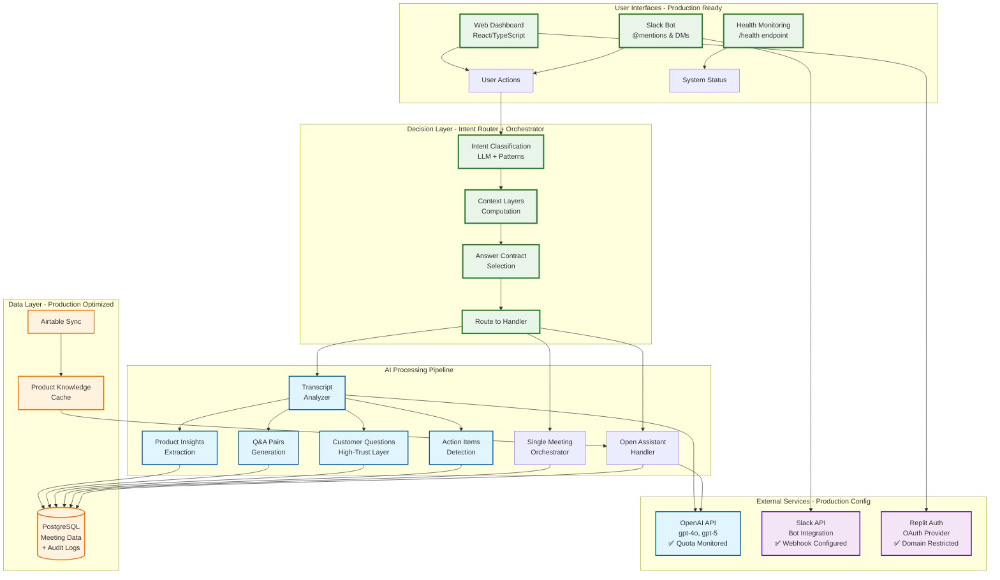
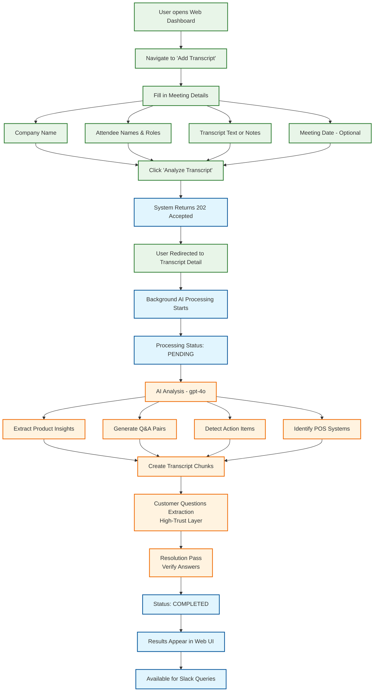
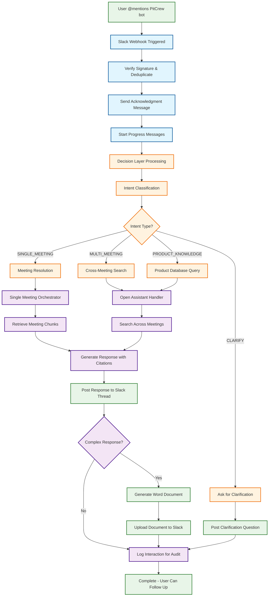
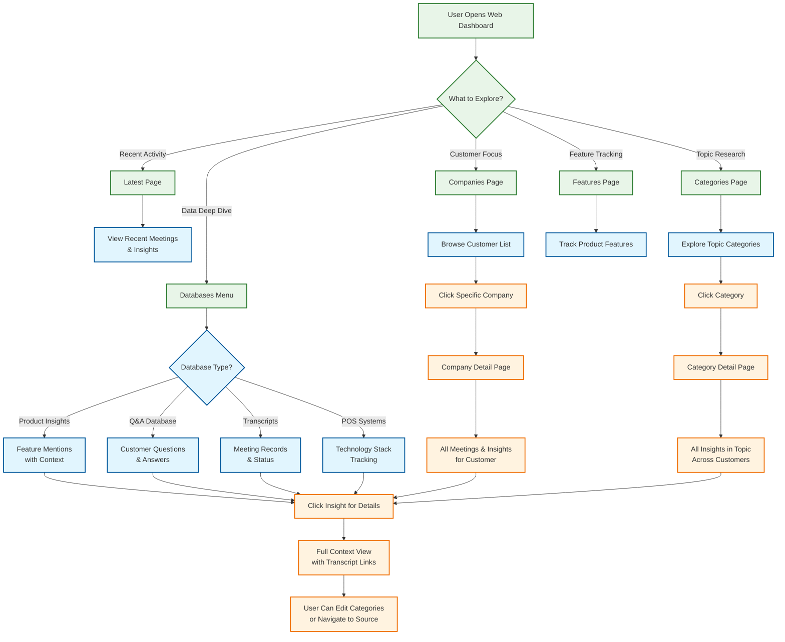
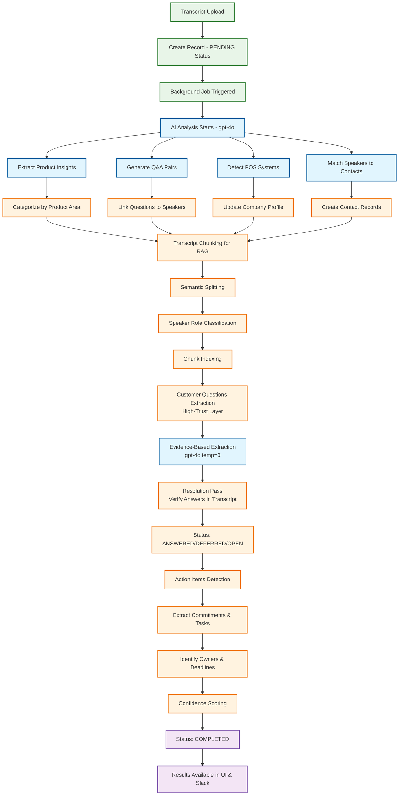
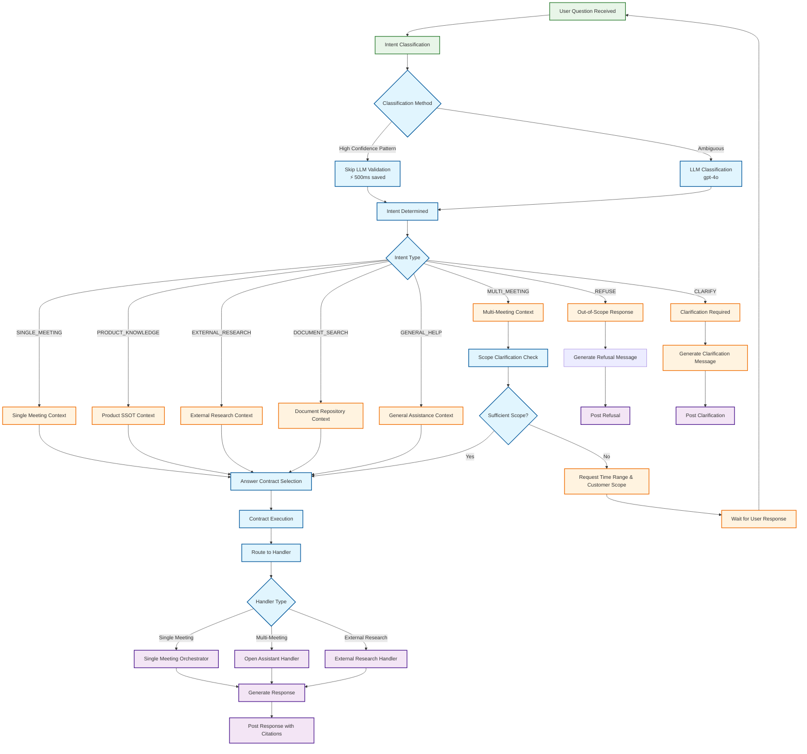
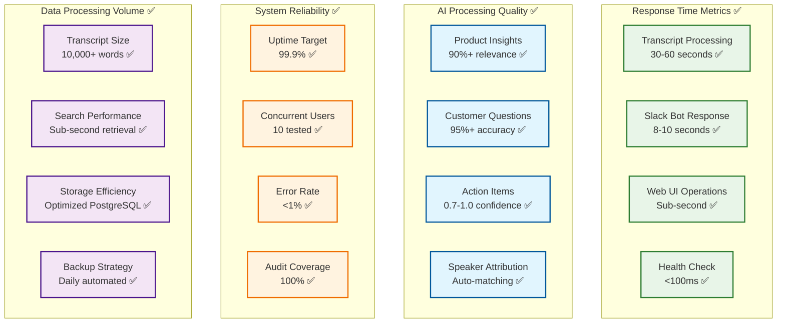

# Visual System Diagrams - Production Ready

## Production System Overview

## User Workflow Diagrams

### Workflow 1: Upload & Analyze Meeting Transcript

### Workflow 2: Ask Questions via Slack Bot

### Workflow 3: Browse Intelligence via Web Dashboard

## AI Processing Pipeline Diagrams

### Transcript Analysis Pipeline

### Decision Layer Processing

## Production Performance Metrics

### System Performance Dashboard

## Production Deployment Architecture

```mermaid
graph TB
    subgraph "Production Environment - 10 Users"
        A[Load Balancer<br/>Health Check Enabled] --> B[Application Server<br/>Single Instance]
        B --> C[PostgreSQL Database<br/>Connection Pool: 20]
        B --> D[Session Store<br/>PostgreSQL Sessions]
        
        E[Daily Backup<br/>Automated] --> C
        F[Health Monitoring<br/>/health endpoint] --> B
        G[Log Aggregation<br/>Structured JSON] --> B
    end
    
    subgraph "External Services - Production Config"
        H[OpenAI API<br/>gpt-4o, gpt-5<br/>Quota Monitored]
        I[Airtable API<br/>Product Knowledge<br/>Webhook Sync]
        J[Slack API<br/>Bot Integration<br/>Event Subscriptions]
        K[Replit Auth<br/>OAuth Provider<br/>leverege.com only]
    end
    
    subgraph "Security & Compliance"
        L[HTTPS Termination<br/>SSL Certificate]
        M[Rate Limiting<br/>Auth Endpoints]
        N[CSRF Protection<br/>SameSite Cookies]
        O[Audit Logging<br/>Correlation IDs]
    end
    
    B --> H
    B --> I
    B --> J
    B --> K
    
    A --> L
    B --> M
    B --> N
    B --> O
    
    classDef production fill:#e8f5e8,stroke:#2e7d32,stroke-width:2px
    classDef external fill:#e1f5fe,stroke:#01579b,stroke-width:2px
    classDef security fill:#fff3e0,stroke:#ef6c00,stroke-width:2px
    classDef monitoring fill:#f3e5f5,stroke:#4a148c,stroke-width:2px
    
    class A,B,C,D production
    class H,I,J,K external
    class L,M,N,O security
    class E,F,G monitoring
```

---

These production-ready visual diagrams accurately represent the current PitCrew system architecture, user workflows, and business processes. The diagrams emphasize the actual Decision Layer architecture, AI processing pipeline, and multi-interface user experience that provides real business value through meeting intelligence automation.