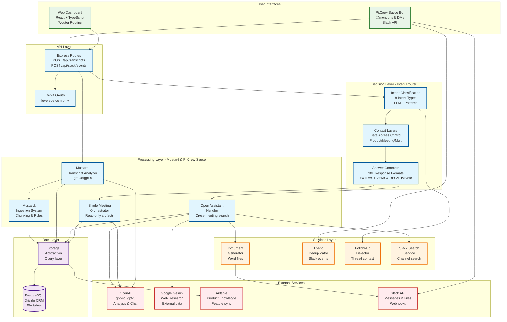

```mermaid
graph TB
    Start([User Opens Web Dashboard]) --> Upload[Click 'Add Transcript']
    Upload --> Form[Fill Form:<br/>Company, Attendees, Text/File]
    Form --> Submit[Click 'Analyze Transcript']
    
    Submit --> API[POST /api/transcripts]
    API --> CreateRecord[Create Transcript Record<br/>Status: PENDING]
    CreateRecord --> Return202[Return 202 Accepted<br/>Redirect to Detail Page]
    
    Return202 --> Background[Mustard: Background Processing Starts]
    
    Background --> UpdateStatus1[Update Status: PROCESSING]
    UpdateStatus1 --> AIAnalysis[Mustard: AI Analysis<br/>gpt-4o/gpt-5]
    
    AIAnalysis --> Extract1[Extract Product Insights<br/>with categories & quotes]
    AIAnalysis --> Extract2[Extract Q&A Pairs<br/>with speaker attribution]
    AIAnalysis --> Extract3[Detect POS Systems<br/>& technology mentions]
    
    Extract1 --> SaveDB1[(Save to Database:<br/>productInsights table)]
    Extract2 --> SaveDB1
    Extract3 --> SaveDB1
    
    SaveDB1 --> Chunking[Mustard: Transcript Chunking<br/>Semantic Splits]
    Chunking --> ParseTurns[Parse Speaker Turns<br/>speaker + text]
    ParseTurns --> AssignRoles[Assign Speaker Roles<br/>leverege/customer/unknown]
    AssignRoles --> CreateChunks[Create Semantic Chunks<br/>with speaker context]
    CreateChunks --> SaveChunks[(Save to Database:<br/>transcriptChunks table)]
    
    SaveChunks --> HighTrust[Mustard: Customer Questions<br/>High-Trust Extraction<br/>gpt-4o temp=0]
    HighTrust --> Resolution[Resolution Pass:<br/>ANSWERED/DEFERRED/OPEN]
    Resolution --> SaveCQ[(Save to Database:<br/>customerQuestions table)]
    
    SaveCQ --> ActionItems[Mustard: Action Items<br/>Extraction]
    ActionItems --> SaveAI[(Save to Database:<br/>meetingActionItems table)]
    
    SaveAI --> Complete[Update Status: COMPLETED]
    Complete --> UIUpdate[UI Shows Results:<br/>Insights, Q&A, Action Items]
    UIUpdate --> End([User Views & Searches])
    
    classDef user fill:#e8f5e8,stroke:#2e7d32,stroke-width:2px
    classDef api fill:#e1f5fe,stroke:#01579b,stroke-width:2px
    classDef ai fill:#fff3e0,stroke:#ef6c00,stroke-width:2px
    classDef db fill:#f3e5f5,stroke:#4a148c,stroke-width:2px
    
    class Start,Upload,Form,Submit,End user
    class API,CreateRecord,Return202,Background,UpdateStatus1,Complete,UIUpdate api
    class AIAnalysis,Extract1,Extract2,Extract3,Chunking,ParseTurns,AssignRoles,CreateChunks,HighTrust,Resolution,ActionItems ai
    class SaveDB1,SaveChunks,SaveCQ,SaveAI db
```

# Visual System Diagrams - End-to-End Flows

**Last Updated**: February 13, 2026  
**Purpose**: Visual representation of core system flows

---

## Table of Contents
1. [Transcript Upload Flow](#transcript-upload-flow)
2. [Slack User Interaction Flow](#slack-user-interaction-flow)
3. [System Architecture Overview](#system-architecture-overview)

---

## Transcript Upload Flow

### Complete End-to-End Process



**Key Steps**:
1. **User Input** (1-2 seconds): User fills form with company, attendees, and transcript text/file
2. **Immediate Response** (< 1 second): System returns 202 Accepted, creates PENDING record
3. **Mustard AI Analysis** (20-40 seconds): Extract insights, Q&A, POS systems using gpt-4o/gpt-5
4. **Mustard Chunking** (5-10 seconds): Parse speakers, assign roles, create semantic chunks for RAG
5. **Mustard Artifact Extraction** (10-20 seconds): Customer questions (high-trust), action items
6. **Completion** (< 1 second): Update status to COMPLETED, show results in UI

**Total Time**: 30-60 seconds for complete processing

**Note**: "Mustard" is the transcript processing system that handles all AI analysis and extraction.

---

## Slack User Interaction Flow

### Complete End-to-End Process

```mermaid
graph TB
    Start([User @mentions PitCrew Sauce in Slack]) --> Webhook[Slack Webhook Triggered<br/>POST /api/slack/events]
    Webhook --> Verify[Verify Signature<br/>HMAC validation]
    Verify --> Dedupe{Duplicate<br/>Event?}
    
    Dedupe -->|Yes| Ignore[Ignore Event<br/>Already processed]
    Dedupe -->|No| Ack[PitCrew Sauce: Send Acknowledgment<br/>'On it!' message]
    
    Ack --> Decision[Decision Layer:<br/>Intent Classification]
    
    Decision --> Intent[Intent Classification<br/>LLM-based (gpt-4o)<br/>with minimal fast-paths<br/>8 intent types]
    Intent --> Context[Context Layers<br/>Determine data access scope]
    Context --> Contract[Answer Contract<br/>Select response format<br/>30+ contract types]
    
    Contract --> Route{Route to<br/>Handler}
    
    Route -->|SINGLE_MEETING| Meeting[Single Meeting<br/>Orchestrator]
    Route -->|MULTI_MEETING| Open[Open Assistant<br/>Handler]
    Route -->|PRODUCT_KNOWLEDGE| Open
    Route -->|EXTERNAL_RESEARCH| Open
    Route -->|SLACK_SEARCH| Open
    Route -->|GENERAL_HELP| Open
    Route -->|CLARIFY| Clarify[Ask for<br/>Clarification]
    Route -->|REFUSE| Refuse[Out of Scope<br/>Response]
    
    Meeting --> ResolveMeeting[Resolve Meeting<br/>from thread/message context]
    ResolveMeeting --> GetData1[(Get Meeting Data:<br/>Attendees, Q&A, Actions,<br/>Transcript Chunks)]
    GetData1 --> Execute1[Execute Contract:<br/>Extractive/Aggregative/Summary]
    
    Open --> GetData2[(Search/Query Data:<br/>Cross-meeting search,<br/>Product knowledge,<br/>External research)]
    GetData2 --> Execute2[Execute Contract Chain:<br/>Step 1: Gather evidence<br/>Step 2: Analyze patterns<br/>Step 3: Format output]
    
    Execute1 --> Generate[Generate Response<br/>with Citations & Evidence]
    Execute2 --> Generate
    Clarify --> Generate
    Refuse --> Generate
    
    Generate --> Document{Generate<br/>Document?}
    
    Document -->|Yes| CreateDoc[Create Word Doc<br/>with PitCrew Branding<br/>& Evidence]
    Document -->|No| TextOnly[Text Response Only<br/>with Slack formatting]
    
    CreateDoc --> Upload[Upload to Slack<br/>as file attachment]
    TextOnly --> Post[PitCrew Sauce: Post to Slack Thread<br/>with citations]
    Upload --> Post
    
    Post --> Log[Log Interaction<br/>with Correlation ID<br/>to interactionLogs table]
    Log --> End([User Sees Response<br/>& Optional Document])
    
    classDef user fill:#e8f5e8,stroke:#2e7d32,stroke-width:2px
    classDef slack fill:#e1f5fe,stroke:#01579b,stroke-width:2px
    classDef decision fill:#fff3e0,stroke:#ef6c00,stroke-width:2px
    classDef handler fill:#f3e5f5,stroke:#4a148c,stroke-width:2px
    classDef output fill:#ffebee,stroke:#c62828,stroke-width:2px
    
    class Start,End user
    class Webhook,Verify,Dedupe,Ignore,Ack,Post,Upload slack
    class Decision,Intent,Context,Contract,Route decision
    class Meeting,Open,ResolveMeeting,GetData1,GetData2,Execute1,Execute2,Clarify,Refuse handler
    class Generate,Document,CreateDoc,TextOnly,Log output
```

**Key Steps**:
1. **Webhook** (< 100ms): Receive event, verify HMAC signature, deduplicate using event ID
2. **PitCrew Sauce Acknowledgment** (< 200ms): Send "On it!" message to user
3. **Decision Layer** (300-500ms): 
   - Classify intent (8 types: SINGLE_MEETING, MULTI_MEETING, PRODUCT_KNOWLEDGE, EXTERNAL_RESEARCH, SLACK_SEARCH, GENERAL_HELP, REFUSE, CLARIFY)
   - Determine context layers (what data to access)
   - Select answer contract or contract chain (30+ response formats)
4. **Handler Execution** (5-15 seconds): 
   - Single Meeting Orchestrator: Direct data retrieval from meeting artifacts (attendees → Q&A → actions → transcript)
   - Open Assistant: Execute contract chain for multi-step processing
     - Example chain: PATTERN_ANALYSIS → COMPARISON → DRAFT_RESPONSE
     - Each contract receives previous output as context
     - Enforces evidence thresholds and authority constraints
5. **Response Generation** (2-5 seconds): Format response with citations, optionally create Word document
6. **Delivery** (< 1 second): Post to Slack thread, upload document if needed, log interaction with contract chain metadata

**Total Time**: 8-20 seconds average (varies by query complexity and contract chain length)

**Note**: "PitCrew Sauce" is the Slack bot that handles all user interactions and queries.

---

## System Architecture Overview

### High-Level Component Interaction



**Component Responsibilities**:

- **User Interfaces**: 
  - Web dashboard (React/TypeScript) for browsing transcripts and insights
  - PitCrew Sauce bot (Slack) for conversational queries and document generation
  
- **API Layer**: 
  - Express routes for transcript upload and Slack webhooks
  - Replit OAuth authentication (leverege.com domain only)
  
- **Decision Layer**: 
  - Intent classification (8 types: SINGLE_MEETING, MULTI_MEETING, PRODUCT_KNOWLEDGE, EXTERNAL_RESEARCH, SLACK_SEARCH, GENERAL_HELP, REFUSE, CLARIFY)
  - Context determination (what data to access)
  - Contract selection (30+ response formats)
  
- **Processing Layer**: 
  - Mustard: Transcript analysis and ingestion (AI extraction, chunking, speaker roles)
  - PitCrew Sauce: Single Meeting Orchestrator (read-only meeting artifacts)
  - PitCrew Sauce: Open Assistant Handler (cross-meeting search, synthesis)
  
- **Services Layer**: 
  - Document generation (Word files with branding)
  - Event deduplication (prevent duplicate Slack processing)
  - Follow-up detection (thread context awareness)
  - Slack search service (channel search configuration)
  
- **Data Layer**: 
  - PostgreSQL database (20+ tables: transcripts, companies, productInsights, qaDatabase, etc.)
  - Storage abstraction (query layer over Drizzle ORM)
  
- **External Services**: 
  - OpenAI (gpt-4o, gpt-5 for analysis and chat)
  - Google Gemini (web research for external data)
  - Airtable (product knowledge synchronization)
  - Slack API (messages, files, webhooks)

---

## Data Flow Patterns

### Pattern 1: Transcript Processing (Mustard)
```
Upload → Create Record → Background Job → AI Analysis → Extraction → Chunking → Artifacts → Complete
```

### Pattern 2: Slack Query - Single Meeting (PitCrew Sauce)
```
@mention → Decision Layer → Meeting Resolution → Direct Retrieval → Response → Post
```

### Pattern 3: Slack Query - Multi-Meeting (PitCrew Sauce with Contract Chain)
```
@mention → Decision Layer → Search → Contract Chain Execution → Synthesis → Response → Post

Contract Chain Example (MULTI_MEETING):
  Step 1: PATTERN_ANALYSIS (gather evidence from meetings)
  Step 2: COMPARISON (analyze patterns across companies)
  Step 3: DRAFT_RESPONSE (format final output)
  
Each contract:
  - Receives output from previous contract as context
  - Has its own constraints (evidence threshold, authority level)
  - Contributes to final response
```

### Pattern 4: Product Knowledge
```
Query → Decision Layer → Airtable Cache → Format → Response
```

---

**Last Updated**: February 13, 2026  
**Purpose**: Visual reference for system flows and architecture
