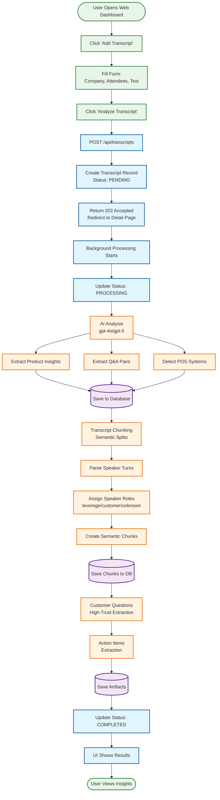
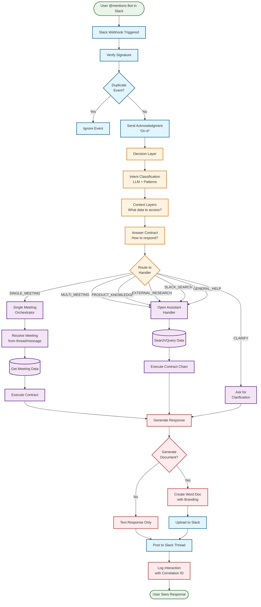
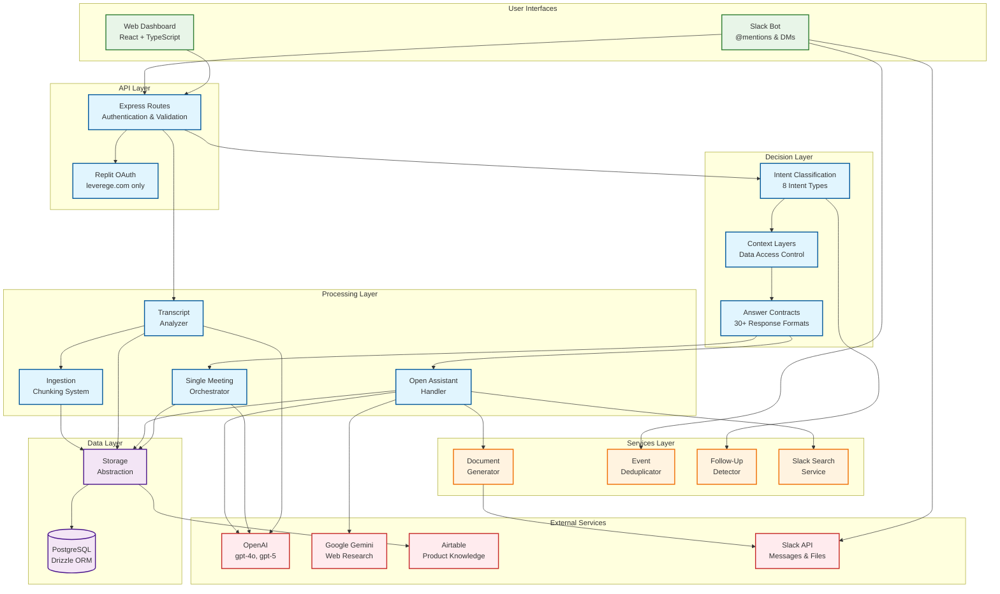

# Visual System Diagrams - End-to-End Flows

**Last Updated**: February 13, 2026  
**Purpose**: Visual representation of core system flows

---

## Table of Contents
1. [Transcript Upload Flow](#transcript-upload-flow)
2. [Slack User Interaction Flow](#slack-user-interaction-flow)
3. [System Architecture Overview](#system-architecture-overview)

---

## Transcript Upload Flow

### Complete End-to-End Process



**Key Steps**:
1. **User Input** (1-2 seconds): User fills form and submits
2. **Immediate Response** (< 1 second): System returns 202 Accepted, creates PENDING record
3. **AI Analysis** (20-40 seconds): Extract insights, Q&A, POS systems
4. **Chunking** (5-10 seconds): Parse and create semantic chunks
5. **Artifact Extraction** (10-20 seconds): Customer questions, action items
6. **Completion** (< 1 second): Update status, show results

**Total Time**: 30-60 seconds for complete processing

---

## Slack User Interaction Flow

### Complete End-to-End Process



**Key Steps**:
1. **Webhook** (< 100ms): Receive event, verify signature, deduplicate
2. **Acknowledgment** (< 200ms): Send "On it!" message to user
3. **Decision Layer** (300-500ms): Classify intent, determine context, select contract
4. **Handler Execution** (5-15 seconds): 
   - Single Meeting: Direct data retrieval
   - Open Assistant: Search, analysis, synthesis
5. **Response Generation** (2-5 seconds): Format response, optionally create document
6. **Delivery** (< 1 second): Post to Slack, log interaction

**Total Time**: 8-20 seconds average (varies by query complexity)

---

## System Architecture Overview

### High-Level Component Interaction



**Component Responsibilities**:

- **User Interfaces**: Web dashboard and Slack bot for user interaction
- **API Layer**: Authentication, routing, validation
- **Decision Layer**: Intent classification, context determination, contract selection
- **Processing Layer**: Query execution, transcript analysis, data extraction
- **Services Layer**: Supporting services (documents, deduplication, follow-ups)
- **Data Layer**: Database access and storage abstraction
- **External Services**: AI models, product knowledge, Slack API

---

## Data Flow Patterns

### Pattern 1: Transcript Processing
```
Upload → Create Record → Background Job → AI Analysis → Extraction → Chunking → Artifacts → Complete
```

### Pattern 2: Slack Query (Single Meeting)
```
@mention → Decision Layer → Meeting Resolution → Direct Retrieval → Response → Post
```

### Pattern 3: Slack Query (Multi-Meeting)
```
@mention → Decision Layer → Search → Contract Chain → Synthesis → Response → Post
```

### Pattern 4: Product Knowledge
```
Query → Decision Layer → Airtable Cache → Format → Response
```

---

**Last Updated**: February 13, 2026  
**Purpose**: Visual reference for system flows and architecture
