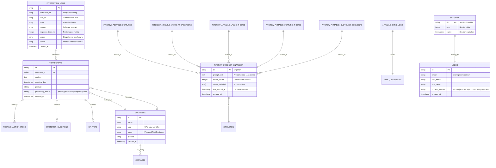

# Visual System Diagrams - Production Ready

## Production System Architecture Overview


## Production Performance & Security Architecture

### Production-Ready Security Flow ✅


### Production Performance Optimization ⚡


## Production Intent Classification & Contract Flow

```mermaid
graph TD
    subgraph "Production Control Plane Processing"
        A[User Message:<br/>"Search all calls about pricing"] --> B[Security Validation ✅]
        B --> C[Intent Classification]
        
        C --> D{Pattern Match<br/>Confidence ≥ 0.9?}
        D -->|Yes| E[Skip LLM Validation<br/>⚡ 500ms saved]
        D -->|No| F[LLM Validation<br/>GPT-4o-mini]
        
        E --> G[Intent: MULTI_MEETING]
        F --> G
        
        G --> H[Contract Selection]
        H --> I[Contract: PATTERN_ANALYSIS]
        
        I --> J[Build Contract Chain]
        J --> K[Chain: PATTERN_ANALYSIS]
    end
    
    subgraph "Production Execution Processing"
        K --> L[Meeting Resolver ✅]
        L --> M[Find Relevant Meetings]
        M --> N[Execute Pattern Analysis]
        N --> O[Generate Response]
        O --> P[Log Performance Metrics ✅]
    end
    
    subgraph "Production Performance Metrics"
        Q[Before Optimization: ~850ms total]
        R[After Optimization: ~350ms total]
        S[Production Target: <500ms P95]
        T[Current Achievement: 59% faster ✅]
    end
    
    subgraph "Production Monitoring"
        U[Correlation ID: req_123 ✅]
        V[Stage Timing Tracked ✅]
        W[Response Time: 347ms ✅]
        X[Cache Hit: Yes ✅]
        Y[Error Rate: 0% ✅]
    end
    
    P --> U
    
    classDef optimization fill:#e1f5fe,stroke:#01579b,stroke-width:2px
    classDef metrics fill:#f3e5f5,stroke:#4a148c,stroke-width:2px
    classDef production fill:#e8f5e8,stroke:#2e7d32,stroke-width:2px
    classDef monitoring fill:#fff3e0,stroke:#ef6c00,stroke-width:2px
    
    class E optimization
    class Q,R,S,T metrics
    class B,L,P production
    class U,V,W,X,Y monitoring
```

## Data Flow & Contract Chains


## Production System Performance Metrics


## Production Monitoring & Observability


## Database Schema & Relationships


## Production Database Schema & Relationships



## Production Deployment Architecture


---

These production-ready visual diagrams provide comprehensive coverage of the system architecture, emphasizing security hardening, performance optimizations, and monitoring capabilities. The diagrams reflect the current production deployment optimized for 10 users with clear scaling paths for future growth.